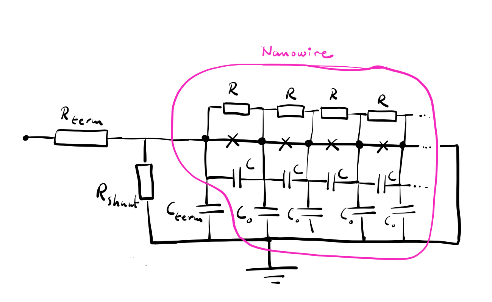

# RCSJ

Simulation of Resistively and Capacitively Shunted Josephson junction array.

## Requirements

The following programs and packages are needed to run this code. Make sure to have them installed before attempting to run the code

- `xmgr` - Program for plotting. Note that the new version, xmgrace, is not compatible with this reository. Instructrions for how to install are found [here](INSTALL_XMGR.md).

## Get started

    mkdir snspd
    cd snspd
    git clone https://github.com/jlidmar/RCSJ.git src
    
    cd src
    make
    make install
    
    cd run
    
    nice ./xiv &

or

    sbatch -t 60 -a 1 slurm r xxiv

wait

    ./show .
    
    ./plot-V < V > VV ; xmgr VV

Or for photon detection:

    nice ./xphoton && ./plot-V < V > VV ; xmgr VV &

## Model

### Josephson junction array

Total current through a junction between $x$ and $x+1$

$$
I_x^\text{tot} = C (\dot{V}_{x} - \dot{V}_{x+1}) + I_c \sin(\theta_{x}-\theta_{x+1}) + I_R
$$

where $I_R$ is the quasiparticle tunneling current represented by a nonlinear resistance

$$
I_R =
\begin{cases}
(V_{x} - V_{x+1})/R + I_n, & \text{if} \;|V_{x} - V_{x+1}| > V_g
\\
(V_{x} - V_{x+1})/R_{qp} + I^{qp}_n , & \text{otherwise}
\end{cases}
\\
\left<I_n\right> = 0,
\quad
\left<I_n(t)I_n(t')\right> = \frac {2 k_B T} R \delta(t-t').
$$

and similarly for $I^{qp}_n$.  Here the quasiparticle resistance $R_{qp} \approx R e^{2\Delta/k_B T} \gg R.$

Josephson AC effect

$$
V_x = \frac{\hbar \dot \theta_x}{2e}
$$

Kirshoffs law

$$
C_0 \dot V_x = I^\text{tot}_{x-1} - I^\text{tot}_x
$$

#### Boundary conditions

Left input:
With current bias

$$I_0 = I_b - I_\text{shunt},$$

or with voltage bias $U$:

$$
I_0 = (U - V_1)/R_\text{term} + I_n - I_\text{shunt},
\qquad
\left<I_n\right> = 0,
\quad
\left<I_n(t)I_n(t')\right> = \frac {2 k_B T} {R_\text{term}} \delta(t-t')
$$

where $I_\text{shunt} = V_1/R_\text{shunt} + I_{n,\text{shunt}}$.

Right terminal: Direct connection to ground, $V_N = \theta_N = 0$.

## Parameters

- $I_c$   - Critical current
- $R$    - Shunt resistance. Nonlinear, only if $|V_{x} - V_{x+1}| > V_g$.
- $R_{qp}$ - Quasiparticle resistance if > 0.
- $V_{\text{gap}}$ - Gap voltage $V_g = 2\Delta / e$.
- $C$    - Shunt capacitance
- $C_0$  - Capacitance to ground.
- $R_{\text{term}}$ - Series resistance at input
- $R_{\text{shunt}}$ - Shunt to ground at input
- $C_{\text{term}}$ - Capacitance to ground at input
- $dt$   - Time step.

### Time scales

In the array:

- $\tau_{RC} = RC$
- $\tau_{L/R} = L_K/R$
- $\tau_{LC} = 1/\sqrt{L_K C} = \sqrt{\tau_{RC} \tau_{L/R}}$

where $L_K(I) = \frac \hbar {2e \sqrt{I_c^2 - I_s^2}} \approx \frac \hbar {2e \sqrt{I_c^2 - I_b^2}}$ is the kinetic inductance (per junction).
We set $L_K = L_K(0) = \frac \hbar {2e I_c}$.

At the input:

- $R_\text{tot} C_\text{term}$, where $R_\text{tot}^{-1} = R_\text{term}^{-1} + R_\text{shunt}^{-1}$.
- $L_\text{tot} / R_\text{tot}$, where $L_\text{tot} = N L_K + L_\text{ext}$.

"Quality factor" $Q^2 = \beta = \tau_{RC}/\tau_{L/R} = RC / (L_K/R) = R^2 C / L_K$.

Mooij-Schön velocity $1/\sqrt{L_K C_0}$ per junction.

Array characteristic impedance $Z_0 = \sqrt{L_K/C_0}$.

Total normal state resistance of array $N R$

## Dimensionless units

Measure time in units of $L_K/R$ and currents in units of $I_c$,
where $L_K = \hbar / 2e I_c = \Phi_0 / 2\pi I_c$ is the kinetic inductance at zero bias.

The dimensionless voltage becomes $v_x = V_x (L_K/R) (2\pi / {\Phi_0}) = V_x / R I_c =  \dot \theta$, where the dot now indicates the time derivative wrt the rescaled time $t/\tau_{L/R}$.

The dimensionless current $i_x = I_x^\text{tot}/I_c$ becomes

$$
i_x = Q^2 (\dot{v}_{x} - \dot{v}_{x+1}) + \sin(\theta_{x}-\theta_{x+1}) + i_R,
\\
Q^2 = R^2 C/ L
\\
i_R =
\begin{cases}
(v_{x} - v_{x+1}) + i_n, & \text{if} \;|v_{x} - v_{x+1}| < v_g = V_g/RI_c
\\
(v_{x} - v_{x+1})/r_{qp} + i^{qp}_n , & \text{otherwise}
\end{cases}
\\
\left<i_n\right> = 0,
\quad
\left<i_n(t)i_n(t')\right> = \frac {2 k_B T} {RI_c^2} \frac{R}{L_K}\delta(t-t') = \frac {2 k_B T} {L_K I_c^2}\delta(t-t') = \frac {2 k_B T} {E_J} \delta(t-t').
$$

where $E_J = L_K I_c^2 = \hbar I_c/2e = (\Delta/2) (R_Q/ R)$ is the Josephson energy,
and $R_Q = h/(2e)^2 \approx 6.45 \, k\Omega$ the resistance quantum.

Resistance is measured in units of $R$.

The dimensionless quasiparticle resistance is $r_{qp} = R_{qp}/R \approx \sqrt{k_B T/2\pi \Delta} e^{\Delta / k_B T} \approx \sqrt{T / 2\pi T_c} e^{2 T_c / T} \gg 1$.

The dimensionless impedance is $Z_0 / R = \sqrt{L_K/R^2 C_0} = \lambda/Q$.

The RC and L/R times are $\tau_{RC} = Q^2$ and $\tau_{L/R} = 1$, respectively.

The velocity of the Mooij-Schön mode is $L_K / R/\sqrt{L_K C_0} = \sqrt{L_K/C_0 R^2} = \lambda / Q = Z_0 / R$ junctions / dimensionless time,
where $\lambda  = \sqrt{C/C_0}$ is the charge screening length (in units of $\xi$).

In dimensionless units we can therefore set

    : Ic = 1
    : R  = 1
    : Rqp = ?
    : C  = Q^2
    : C0 = Q^2 / lambda^2
    : Rterm = Rterm / R
    : Rshunt = Rshunt / R
    : Cterm  = Q^2 Cterm / C
    : T = k_B T / E_J = k_B T / L_K Ic^2
    : Vgap = v_g = 2Delta/e R Ic = 4/pi or slightly less, maybe 1.

Note that $I_c$, $NR$, and $Z_0$ should be easy to determine experimentally.

Then $Q/\lambda = (R/Z_0)$, so we can set the dimensionless $C_0 = (R/Z_0)^2$

The velocity is $c_0 = Z_0 / R$ junctions / time unit.
In dimensionfull units it is $1/\sqrt{L_K'C_0'} = (Z_0/L_K) \xi= \xi/Z_0 C_0$.

Possibly one can read off the sum gap voltage $N V_g = N 2 \Delta/e$ from an IV curve?
From the litterature we know $\Delta$, and then we may estimate $N$?

### Microscopically, for Josephson juncions

Using the Ambegaokar-Baratoff relation $I_c = \frac{\pi \Delta}{2 e R} \tanh \frac \Delta {2k_BT}$.

The gap voltage $V_g = 2\Delta / e \; \Rightarrow \, v_g = 2\Delta / e I_c R = 4 / \pi \tanh (\Delta/2k_B T)$.

Kinetic inductance $L_K(i) = \hbar/2eI_c \sqrt{1-i_b^2} = R \hbar / \pi \Delta \sqrt{1-i_b^2}\tanh(\Delta/2k_BT)$

Assuming $T \lesssim 0.4 T_c$, we take $\Delta(T) \approx \Delta_0$ and $\tanh(\Delta/2k_B T) \approx 1$.

## Superconducting nanowires

Discretize using a lattice constant $\approx \xi =$ the superconducting coherence length.

Note that in the discrete model the kinetic inductance is $L_K(i) = \hbar / 2e \sqrt{I_c - I_b^2} = L_K(0) / \sqrt{1-i_b^2}$ is larger than $L_K \equiv L_K(0)$, especially close to the critical current.  For a continuous superconducting nanowire we similarly expect from GL that the supercurrent density obeys

$$
J_s = 2e n_s (1 - (v/v_0)^2) v
$$

and therefore that $L_K$ increase near $I_c$.

### Depairing current

London limit depairing current density: $J_d = H_c/\lambda_L = \Phi_0/2\pi \mu_0 \lambda_L^2 \xi$, where $2 e n_s = 1/\mu_0 \lambda_L^2$.
The corresponding $I_c = J_d s = \Phi_0 / 2\pi L_K = \hbar / 2e L_K$ (as above!).

GL depairing current density differs by a numerical factor: $J_d = \Phi_0/ 3 \sqrt 3 \pi \mu_0 \lambda_L^2 \xi$.

Up to a numerical factor of order one these relations agree with $J_d = \sigma \frac {2\Delta} {e \xi} \; \Rightarrow \; I_c = V_g/R$.

### Quasiparticles

The shunt resistors in the model describe the dissipation caused by quasiparticles in a two fluid model of superconductivity.
At low temperatures the density of quasiparticles is strongly suppressed,
$n_{qp}(T) = n e^{-\Delta / k_B T} \ll n$, which motivates using a nonlinear shunt resistor in the model.
For small currents or eqivallently $|V_{x}-V_{x+1}| < V_g = 2 \Delta/ e$ we thus ignore their contribution, while for $|V_{x}-V_{x+1}| > V_g$ we assume that the quasiparticle current is ohmic with resistance $R$.

This suggests that the model should be applicable also for continous wires. A possible refinement would be to include a subgap resistance.

## Microscopic model of nanowire

(See [Golubev, D. and Zaikin, A. (2001)](http://link.aps.org/doi/10.1103/PhysRevB.64.014504)
_Quantum tunneling of the order parameter in superconducting nanowires_, Physical Review B **64**, 014504. doi: 10.1103/PhysRevB.64.014504.)

Cross section $s$.

Kinetic inductance per length

$$L_K' = \frac {L_K}{\xi} = \frac \hbar {\pi \sigma s \Delta}$$

Capacitance (to ground) per length

$$
C_0' = \frac {C_0} \xi
$$

Parallel capacitance times length

$$
C' = C \xi = \pi \sigma s \hbar/ 8 \Delta
$$

Resistance per length

$$
R' = R/\xi
$$

(Note the consistency with the corresponding relations for Josephson junction arrays: $L_K = \hbar R / \pi \Delta$.)

#### Time scales

$$
\tau_{RC} = R C = R' C' =  \frac{\pi}{4} \frac{\hbar}{2\Delta}
\\[1em]
\tau_{L/R} = L_K/R = L_K'/R' = \frac{2}{\pi} \frac{\hbar}{2\Delta}
\\[1em]
\tau_{LC} = \sqrt{LC} = \sqrt{\tau_{RC} \tau_{L/R}} = \frac 1 {\sqrt 2} \frac \hbar {2\Delta}
$$

The quality factor is

$$
Q^2 = \frac{R'^2 C'}{L_K'} = \frac{R^2 C}{L_K} = \frac{\tau_{RC}}{\tau_{L/R}} = \frac{\pi^2}{8} \approx 1.2337
$$

(Note: The $Q$ is not really a quality factor since the resistance is nonlinear!)  
Still its value is interesting: It is neither large nor small.

Velocity of the Mooij-Schön mode $c_0 = 1/\sqrt{L'C_0'} = \sqrt{\pi\sigma s \Delta / \hbar C_0'}$ in m/s.

Charge screening length $\lambda = \sqrt{C' / C_0'} = \sqrt{C / C_0} \xi = \sqrt{\pi\sigma s \hbar / 8 \Delta C_0'}$

$\lambda / c_0 = \sqrt{L'C'} = \tau_{LC}$

Characteristic impedance $Z_0 = \sqrt{L_K'/C_0'} = \sqrt{\hbar/\pi\sigma s \Delta C_0'}$.

Natural to assume a critical current density $J_c = \sigma V_g / \xi = \sigma 2\Delta/e \xi$.
This then gives a
critical current

$$I_c = J_c s = V_g/ R' \xi = V_g / R = 2\Delta / e R .$$

Note that this is consistent with the relation
$L_K = \hbar / 2e I_c \approx \hbar R/ 4\Delta = \xi \hbar /4 \sigma s \Delta$ up to a factor $\pi /4$.

## Photon detection events ##

When a photon arrives at the nanowire this is modeled as a suppression of the local critical current and the gap voltage of a particular junction $x$,

$$
\frac{I_c(x,\delta t)}{I_c(x,0)} =
\frac{V_\text{gap}(x,\delta t)}{V_\text{gap}(x,0)} =
\begin{cases}
 1 - \delta t / \tau_\text{supr},
 & 0 < \delta t \leq \tau_\text{supr}
\\
 1 - \exp(-[\delta t - \tau_\text{supr}]/ \tau_\text{recov}),
 & 0 < \delta t - \tau_\text{supr} \leq 10 \tau_\text{recov}
\end{cases}
$$

where $\delta t$ is the time since the photon reached the detector.

In the input file this is set using

    : photon = x tau_supr tau_recov photon_time_interval

